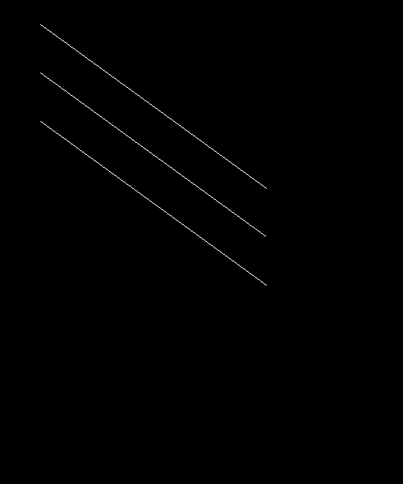

# Line Drawing Algorithms (Rust)

Proyecto de la semana 2 del curso de Computación Gráfica. Implementa tres algoritmos de rasterización de líneas en Rust usando [raylib](https://github.com/raysan5/raylib):

- **Ecuación de la recta** (`y = mx + b`)
- **DDA** (Digital Differential Analyzer)
- **Bresenham** (solo aritmética entera, funciona en los 8 octantes)

## Estructura

- [`src/framebuffer.rs`](src/framebuffer.rs) — envuelve la imagen y expone `set_pixel`.
- [`src/line.rs`](src/line.rs) — funciones `linea_ecuacion`, `dda` y `draw_line` (Bresenham).
- [`src/bmp.rs`](src/bmp.rs) — exporta el framebuffer a disco.
- [`src/main.rs`](src/main.rs) — dibuja las 3 líneas y genera la imagen de salida.

## Cómo ejecutar

```
cargo run
```

Esto genera `out.bmp` en la raíz del proyecto.

## Resultados

**1. Ecuación de la recta**


**2. Ecuación + DDA**


**3. Ecuación + DDA + Bresenham**


**Las 3 líneas apiladas (~36°)**


